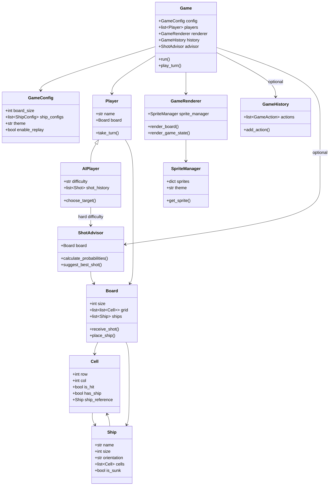
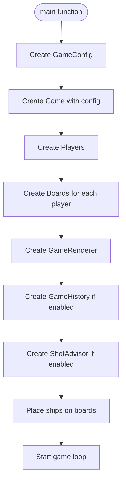
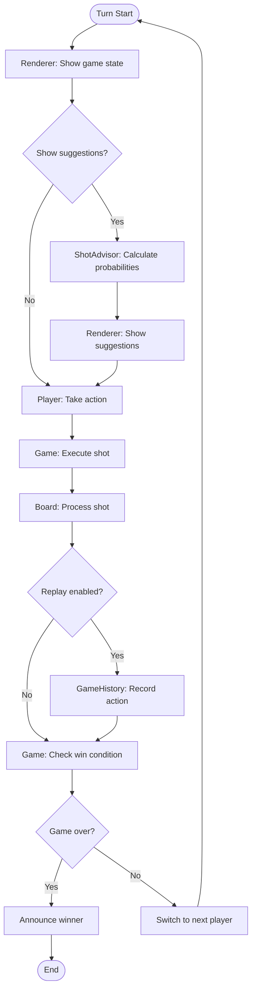
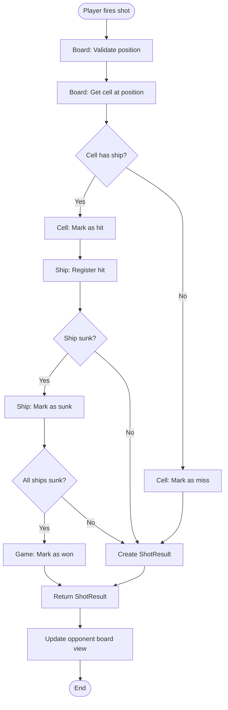

# Battleship Game Architecture

## Overview

This document describes the architecture, classes, and modules for a customizable battleship game. The game supports multiple players (human and computer), configurable board sizes, ship configurations, shot options, replay functionality, and an AI assistant for shot suggestions.

The system is designed with separation of concerns: game logic is separate from rendering, configuration is centralized, and advanced features are modular and optional.

## Module Structure

```
battleship/
├── main.py              # Entry point - main() function
├── config.py            # GameConfig, ShipConfig, PlayerConfig
├── cell.py              # Cell class
├── ship.py              # Ship class
├── board.py             # Board class
├── player.py            # Player base class
├── ai_player.py         # AIPlayer (extends Player)
├── shot.py              # Shot, ShotResult
├── weapon.py            # Weapon, WeaponManager (optional)
├── game.py              # Game main controller
├── game_history.py      # GameHistory, GameAction (replay)
├── shot_advisor.py      # ShotAdvisor (suggestions)
├── ship_placer.py       # ShipPlacer (placement logic)
└── renderer.py          # GameRenderer, SpriteManager
```

## Core Classes

### Cell (`cell.py`)

**Purpose**: Represents a single cell/square on the game board.

**Attributes**:
- `row: int` - Row position on the board
- `col: int` - Column position on the board
- `is_hit: bool` - Whether this cell has been shot
- `has_ship: bool` - Whether a ship occupies this cell
- `ship_reference: Ship | None` - Reference to the ship occupying this cell (if any)

**Methods**:
- `mark_hit() -> None` - Mark this cell as hit
- `place_ship(ship: Ship) -> None` - Place a ship on this cell
- `clear_ship() -> None` - Remove ship reference from this cell
- `get_symbol(show_ships: bool = False) -> str` - Get display symbol for this cell

**Relationships**:
- Belongs to a `Board` (part of grid)
- May reference a `Ship`

**Notes**: Basic building block of the board. All game state changes flow through Cell objects.

---

### Ship (`ship.py`)

**Purpose**: Represents a ship/boat on the board with its state and position.

**Attributes**:
- `name: str` - Name of the ship (e.g., "Carrier", "Battleship")
- `size: int` - Length of the ship (number of cells)
- `cells: list[Cell]` - List of cells this ship occupies
- `hits: int` - Number of times this ship has been hit
- `is_sunk: bool` - Whether the ship is completely destroyed
- `orientation: str` - "horizontal" or "vertical" (set during placement, immutable after)

**Methods**:
- `place(cells: list[Cell]) -> None` - Place ship on specified cells
- `hit() -> None` - Register a hit on this ship
- `check_if_sunk() -> bool` - Check if ship is sunk (hits == size)
- `get_cells() -> list[Cell]` - Get all cells occupied by this ship
- `remove_from_board() -> None` - Remove ship from all cells

**Relationships**:
- Contains multiple `Cell` objects
- Belongs to a `Board`

**Notes**: 
- Orientation is set during creation/placement and does not change after placement (no `change_orientation()` method).
- Ship placement logic is handled by `ShipPlacer` or `Board` placement methods, not by the Ship class itself.

---

### Board (`board.py`)

**Purpose**: Represents a player's game board containing cells and ships.

**Attributes**:
- `size: int` - Board dimensions (size x size, typically 10x10)
- `grid: list[list[Cell]]` - 2D array of Cell objects
- `ships: list[Ship]` - List of all ships on this board

**Methods**:
- `__init__(size: int) -> None` - Initialize empty board
- `get_cell(row: int, col: int) -> Cell | None` - Get cell at position
- `is_valid_position(row: int, col: int) -> bool` - Check if coordinates are valid
- `is_valid_placement(ship: Ship, row: int, col: int, orientation: str) -> bool` - Check if ship can be placed
- `place_ship(ship: Ship, row: int, col: int, orientation: str) -> bool` - Place ship on board
- `receive_shot(row: int, col: int) -> ShotResult` - Process a shot at this position
- `all_ships_sunk() -> bool` - Check if all ships are destroyed
- `get_hit_cells() -> list[Cell]` - Get all cells that have been hit
- `get_miss_cells() -> list[Cell]` - Get all cells that were missed

**Relationships**:
- Contains a grid of `Cell` objects
- Contains multiple `Ship` objects
- Owned by a `Player`

**Notes**: Each player has one Board. The board manages ship placement validation and shot processing.

---

### Player (`player.py`)

**Purpose**: Base class representing a player (human or computer).

**Attributes**:
- `name: str` - Player's name
- `board: Board` - This player's own board (where their ships are)
- `opponent_board_view: Board` - View of opponent's board (what they've seen)
- `is_computer: bool` - Whether this is a computer player
- `shots_taken: int` - Number of shots this player has made

**Methods**:
- `take_turn(game: Game) -> None` - Execute player's turn
- `make_shot(row: int, col: int, opponent_board: Board) -> ShotResult` - Fire a shot
- `get_opponent_board() -> Board` - Get view of opponent's board
- `place_ships() -> None` - Place ships on own board (abstract/virtual)

**Relationships**:
- Owns a `Board`
- Has a view of opponent's `Board`
- Used by `Game`

**Notes**: Base class for both human and computer players. Human players will override `take_turn()` to get input, while `AIPlayer` will implement AI logic.

---

### GameConfig (`config.py`)

**Purpose**: Centralized configuration for all game settings and options.

**Attributes**:
- `num_players: int` - Total number of players (default: 2)
- `num_computer_players: int` - Number of computer players (default: 1)
- `board_size: int` - Board dimensions (default: 10)
- `ship_configs: list[ShipConfig]` - List of ship configurations
- `shots_per_turn: int` - Number of shots per turn (default: 1)
- `shots_per_ship: bool` - If True, shots = number of remaining ships (alternative to shots_per_turn)
- `shoot_until_miss: bool` - If True, player continues shooting until they miss
- `volley_mode: bool` - If True, all shots occur simultaneously (can result in ties)
- `enable_weapons: bool` - Enable alternative weapon types (optional feature)
- `enable_replay: bool` - Enable game replay functionality
- `show_suggestions: bool` - Show AI assistant shot suggestions
- `theme: str` - Visual theme ("modern", "ancient", "space", "steampunk")

**Methods**:
- `from_defaults() -> GameConfig` - Create config with default values
- `from_user_input() -> GameConfig` - Create config from user prompts
- `validate() -> bool` - Validate configuration settings

**Relationships**:
- Contains `ShipConfig` objects
- Contains `PlayerConfig` objects
- Used by `Game` to initialize

**Notes**: All game customization options are stored here. Theme is visual only and does not affect gameplay logic.

---

### ShipConfig (`config.py`)

**Purpose**: Configuration for a single ship type.

**Attributes**:
- `name: str` - Ship name (e.g., "Carrier")
- `size: int` - Ship length
- `count: int` - Number of this ship type to place

**Relationships**:
- Used by `GameConfig`
- Used to create `Ship` objects

---

### PlayerConfig (`config.py`)

**Purpose**: Configuration for a single player.

**Attributes**:
- `name: str` - Player name
- `is_computer: bool` - Whether this is a computer player
- `difficulty: str | None` - AI difficulty if computer ("easy", "medium", "hard")

**Relationships**:
- Used by `GameConfig`
- Used to create `Player` or `AIPlayer` objects

---

### Game (`game.py`)

**Purpose**: Main game controller that orchestrates the entire game flow.

**Attributes**:
- `config: GameConfig` - Game configuration
- `players: list[Player]` - List of all players
- `current_player_index: int` - Index of current player
- `turn_number: int` - Current turn number
- `game_over: bool` - Whether game has ended
- `winner: Player | None` - Winning player (if game over)
- `history: GameHistory | None` - Game history for replay (if enabled)
- `advisor: ShotAdvisor | None` - Shot suggestion advisor (if enabled)
- `renderer: GameRenderer` - Game renderer for display

**Methods**:
- `__init__(config: GameConfig) -> None` - Initialize game with config
- `setup_game() -> None` - Set up game (create players, boards)
- `place_all_ships() -> None` - Place ships for all players
- `play_turn() -> None` - Execute one turn
- `handle_shot(player: Player, row: int, col: int) -> ShotResult` - Process a shot
- `check_win_condition() -> bool` - Check if game is won
- `switch_turn() -> None` - Move to next player's turn
- `is_over() -> bool` - Check if game is over
- `get_opponent(player: Player) -> Player` - Get opponent of given player
- `run() -> None` - Main game loop
- `announce_winner() -> None` - Display winner

**Relationships**:
- Contains `GameConfig`
- Contains multiple `Player` objects
- Contains `GameHistory` (optional)
- Contains `ShotAdvisor` (optional)
- Contains `GameRenderer`

**Notes**: Central orchestrator. All game flow goes through the Game class. It coordinates between players, boards, rendering, and optional features.

---

### GameRenderer (`renderer.py`)

**Purpose**: Handles all rendering and display of the game state.

**Attributes**:
- `sprite_manager: SpriteManager` - Manages sprite assets
- `theme: str` - Current visual theme

**Methods**:
- `__init__(theme: str) -> None` - Initialize renderer with theme
- `render_board(board: Board, player_name: str, show_ships: bool = False) -> None` - Render a board
- `render_cell(cell: Cell, position: tuple) -> None` - Render a single cell
- `render_game_state(game: Game) -> None` - Render full game state
- `render_shot_result(result: ShotResult) -> None` - Display shot result
- `render_suggestions(advisor: ShotAdvisor) -> None` - Display shot suggestions
- `render_final_results(game: Game) -> None` - Display game over screen
- `clear_screen() -> None` - Clear display

**Relationships**:
- Uses `SpriteManager` for assets
- Renders `Board`, `Cell`, `Game` states
- Used by `Game`

**Notes**: All visual output goes through the renderer. This separation allows easy switching between text-based and graphical rendering.

---

### SpriteManager (`renderer.py`)

**Purpose**: Manages sprite/image assets for different themes.

**Attributes**:
- `sprites: dict[str, Image/Sprite]` - Dictionary of loaded sprites
- `theme: str` - Current theme

**Methods**:
- `__init__(theme: str) -> None` - Initialize with theme
- `load_sprites(theme: str) -> None` - Load all sprites for theme
- `get_sprite(name: str) -> Image/Sprite | None` - Get sprite by name
- `load_theme(theme: str) -> None` - Switch to different theme

**Relationships**:
- Used by `GameRenderer`

**Notes**: Handles sprite loading and theme switching. Sprites are organized by theme (modern, ancient, space, steampunk).

---

## Advanced Classes

### AIPlayer (`ai_player.py`)

**Purpose**: Computer-controlled player with configurable difficulty levels.

**Attributes** (inherits from `Player`):
- `difficulty: str` - "easy", "medium", or "hard"
- `shot_history: list[Shot]` - History of all shots taken
- `hit_patterns: list[tuple]` - List of consecutive hits (for targeting)
- `last_hit: tuple | None` - Last successful hit position

**Methods**:
- `__init__(name: str, difficulty: str = "medium") -> None` - Initialize AI player
- `take_turn(game: Game) -> None` - Override to use AI targeting
- `choose_target(opponent_board: Board) -> tuple[int, int]` - Select target cell
- `random_shot(opponent_board: Board) -> tuple[int, int]` - Easy: random targeting
- `smart_shot(opponent_board: Board) -> tuple[int, int]` - Medium: hunt mode (target around hits)
- `optimal_shot(opponent_board: Board) -> tuple[int, int]` - Hard: probability-based targeting
- `update_with_hit(row: int, col: int) -> None` - Update targeting after hit
- `update_with_miss(row: int, col: int) -> None` - Update targeting after miss

**Relationships**:
- Extends `Player`
- Uses `ShotAdvisor` for hard difficulty

**Notes**: Different difficulty levels use different targeting strategies. Easy is random, medium uses hunt mode, hard uses probability calculations.

---

### Shot (`shot.py`)

**Purpose**: Represents a single shot fired at the board.

**Attributes**:
- `row: int` - Target row
- `col: int` - Target column
- `player: Player` - Player who fired the shot
- `result: ShotResult` - Result of the shot
- `timestamp: datetime` - When shot was fired (for replay)

**Methods**:
- `execute(board: Board) -> ShotResult` - Execute shot on board

**Relationships**:
- Created by `Player`
- Contains `ShotResult`
- Stored in `GameHistory`

---

### ShotResult (`shot.py`)

**Purpose**: Result of a shot fired at the board.

**Attributes**:
- `hit: bool` - Whether shot hit a ship
- `sunk: bool` - Whether shot sunk a ship
- `ship: Ship | None` - Ship that was hit (if any)
- `message: str` - Human-readable result message

**Relationships**:
- Returned by `Board.receive_shot()`
- Used by `Shot`

---

### Weapon (`weapon.py`) - Optional

**Purpose**: Represents a weapon that can hit multiple squares (alternative to standard single-shot).

**Attributes**:
- `name: str` - Weapon name (e.g., "Bomb", "Line Shot")
- `pattern_function: callable` - Function that returns hit pattern

**Methods**:
- `get_targets(center_row: int, center_col: int, board_size: int) -> list[tuple[int, int]]` - Get all cells this weapon hits

**Relationships**:
- Used by `Player` for alternative shot types
- Managed by `WeaponManager`

**Notes**: Optional feature. If not implemented, all shots are standard single-cell hits.

---

### WeaponManager (`weapon.py`) - Optional

**Purpose**: Manages available weapons.

**Attributes**:
- `weapons: dict[str, Weapon]` - Dictionary of available weapons

**Methods**:
- `get_weapon(name: str) -> Weapon | None` - Get weapon by name
- `register_weapon(weapon: Weapon) -> None` - Add weapon to manager

---

### GameHistory (`game_history.py`)

**Purpose**: Tracks all game actions for replay functionality.

**Attributes**:
- `actions: list[GameAction]` - List of all game actions
- `current_step: int` - Current step in replay

**Methods**:
- `add_action(turn: int, player: Player, action: dict, result: dict) -> None` - Record an action
- `get_action_at_step(step: int) -> GameAction | None` - Get action at specific step
- `replay_to_step(step: int, game: Game) -> None` - Restore game state to step
- `get_all_actions() -> list[GameAction]` - Get complete action history

**Relationships**:
- Contains `GameAction` objects
- Used by `Game` (if replay enabled)

**Notes**: Only created if `GameConfig.enable_replay` is True. Allows stepping through game history.

---

### GameAction (`game_history.py`)

**Purpose**: Represents a single action in game history.

**Attributes**:
- `turn: int` - Turn number
- `player: Player` - Player who performed action
- `action_type: str` - Type of action ("shot", "ship_placement", etc.)
- `action_data: dict` - Action-specific data
- `result: dict` - Result of the action

**Relationships**:
- Stored in `GameHistory`

---

### ShotAdvisor (`shot_advisor.py`)

**Purpose**: Suggests optimal shot placements based on probability calculations.

**Attributes**:
- `board: Board` - Board being analyzed
- `probability_grid: list[list[float]]` - 2D grid of hit probabilities
- `remaining_ships: list[int]` - Sizes of remaining ships
- `known_hits: list[tuple[int, int]]` - Known hit positions

**Methods**:
- `__init__(board: Board, remaining_ships: list[int]) -> None` - Initialize advisor
- `calculate_probabilities() -> None` - Calculate probability for each cell
- `suggest_best_shot() -> tuple[int, int]` - Return cell with highest probability
- `get_probability_grid() -> list[list[float]]` - Get full probability grid
- `update_with_hit(row: int, col: int) -> None` - Update probabilities after hit
- `update_with_miss(row: int, col: int) -> None` - Update probabilities after miss

**Relationships**:
- Analyzes `Board`
- Used by `Game` (if suggestions enabled)
- Used by `AIPlayer` (hard difficulty)

**Notes**: Only created if `GameConfig.show_suggestions` is True. Calculates probabilities based on valid ship placements.

---

### ShipPlacer (`ship_placer.py`)

**Purpose**: Handles ship placement logic and validation.

**Attributes**:
- `board: Board` - Board to place ships on

**Methods**:
- `__init__(board: Board) -> None` - Initialize placer
- `place_ship(ship: Ship, row: int, col: int, orientation: str) -> bool` - Place ship on board
- `place_ship_randomly(ship: Ship) -> bool` - Place ship at random valid position
- `place_ship_manually(ship: Ship, row: int, col: int, orientation: str) -> bool` - Place ship at specified position
- `validate_placement(ship: Ship, row: int, col: int, orientation: str) -> bool` - Check if placement is valid
- `get_valid_placements(ship: Ship) -> list[tuple[int, int, str]]` - Get all valid placement options
- `rotate_ship_before_placement(ship: Ship) -> None` - Rotate ship orientation (before placement)

**Relationships**:
- Works with `Board` and `Ship`

**Notes**: Handles all placement logic. Orientation rotation happens here before placement, not in Ship class.

---

## Class Relationships



## Data Flow

### Game Initialization Flow



### Turn Execution Flow



### Shot Processing Flow



## Key Design Decisions

### 1. Ship Orientation Handling

**Decision**: Ship orientation is set during creation/placement and is immutable after placement.

**Rationale**: 
- Keeps Ship class simple and focused on ship state
- Prevents invalid state changes
- Placement logic (ShipPlacer) handles rotation before placement

**Implementation**: 
- No `change_orientation()` method on Ship class
- Orientation set in `Ship.__init__()` or during `Board.place_ship()`
- ShipPlacer handles rotation before placement if needed

### 2. Theme System

**Decision**: Themes are purely visual and do not affect gameplay logic.

**Rationale**:
- Separation of concerns (visual vs. logic)
- Easy to add new themes without changing game logic
- Themes stored in GameConfig, used by Renderer

**Implementation**:
- Theme stored in `GameConfig.theme`
- `SpriteManager` loads theme-specific sprites
- `GameRenderer` uses sprites based on theme
- Ship class does not know about themes

### 3. Sprite Management

**Decision**: Separate SpriteManager class handles all sprite loading and theme switching.

**Rationale**:
- Centralized asset management
- Easy to swap themes
- Clear separation from rendering logic

**Implementation**:
- `SpriteManager` loads and organizes sprites by theme
- `GameRenderer` uses `SpriteManager` to get sprites
- Sprites selected based on cell state and theme

### 4. Replay System

**Decision**: GameHistory tracks all actions separately from game state.

**Rationale**:
- Allows replay without affecting current game
- Can step through history
- Optional feature (only created if enabled)

**Implementation**:
- `GameHistory` records all actions as they happen
- Each action includes turn, player, action data, and result
- Replay restores game state to specific step
- Only created if `GameConfig.enable_replay` is True

### 5. AI Difficulty Levels

**Decision**: Different difficulty levels use different targeting strategies.

**Rationale**:
- Easy to implement and understand
- Clear progression of difficulty
- Hard mode can use probability calculations

**Implementation**:
- Easy: Random targeting
- Medium: Hunt mode (target around known hits)
- Hard: Probability-based targeting (uses ShotAdvisor)

### 6. Shot Advisor System

**Decision**: Probability-based suggestions calculated from valid ship placements.

**Rationale**:
- Provides helpful hints for players
- Can be used by AI for hard difficulty
- Optional feature

**Implementation**:
- `ShotAdvisor` calculates probability for each cell
- Probabilities based on remaining ship sizes and valid placements
- Updates after each shot
- Only created if `GameConfig.show_suggestions` is True

### 7. Modular Advanced Features

**Decision**: Advanced features (replay, suggestions, weapons) are optional and modular.

**Rationale**:
- Keep core game simple
- Easy to add/remove features
- Features don't interfere with each other

**Implementation**:
- Features only created if enabled in GameConfig
- Each feature is self-contained
- Game class coordinates features but doesn't depend on them

## Implementation Notes

### Core Implementation Order

1. **Cell** - Basic building block
2. **Ship** - Ship logic (no orientation change method)
3. **Board** - Board management
4. **Player** - Base player class
5. **GameConfig** - Configuration system
6. **GameRenderer** - Basic rendering (text-based to start)
7. **Game** - Main controller
8. **main()** - Entry point

### Advanced Features (Add Later)

9. **AIPlayer** - Computer players
10. **Shot, ShotResult** - Shot tracking
11. **GameHistory** - Replay system
12. **ShotAdvisor** - Suggestions
13. **Weapon** - Alternative weapons (optional)
14. **ShipPlacer** - Placement helpers
15. **SpriteManager** - Graphical sprites (if moving to graphics)

### Testing Considerations

- Each class should be testable independently
- Mock dependencies for unit tests
- Game logic separate from rendering (easy to test)
- Configuration allows easy test setup

### Extension Points

- New weapon types: Add to WeaponManager
- New AI strategies: Extend AIPlayer methods
- New themes: Add sprite sets to SpriteManager
- New game modes: Extend GameConfig and Game
- New board shapes: Extend Board class
